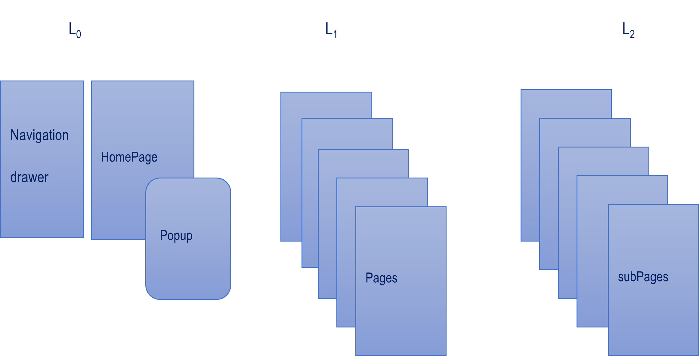
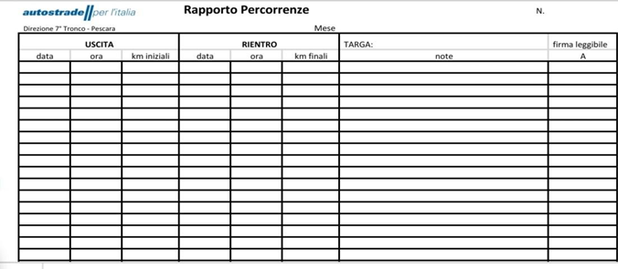
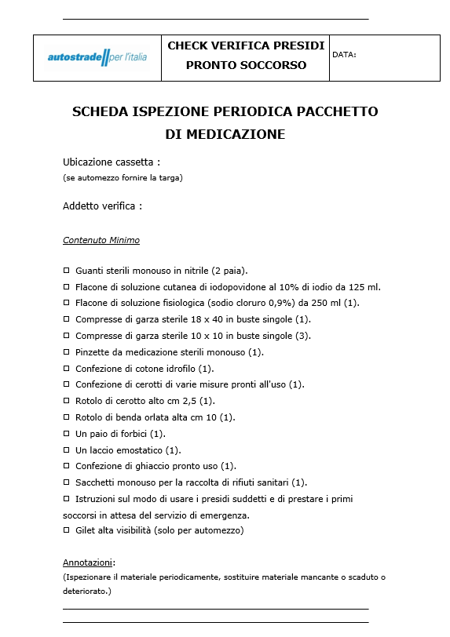

**Logbook. Filosofia della App**

*To make as easy as possible the start of the working day.*

Prima di iniziare la specifica attività lavorativa (ad es. la
manutenzione programmata su un impianto *in itinere*), ogni giorno devo
ottemperare a tutta una serie di compiti - in
sintesi  di verifica e controllo degli equipaggiamenti e
dell\'autoveicolo che andrò ad utilizzare).

Sono moduli e liste di controllo da compilare in forma cartacea,
riconducibili a Ordini di servizio o Norme più in generale. Come autista
non è presupposto necessariamente che ci sia da un lato un compendio
organizzato delle attività da svolgere, e dall\'altro un unico strumento
che raccolga e tracci quanto fatto. Pertanto in partenza sarebbe ideale
raggruppare le attività di inizio giornata in un elenco gestibile *a
colpo d\'occhio*, \[specialmente per avere sotto mano scadenze, da non
dimenticare, di attività prioritarie e/o indifferibili.\]

Successivamente dal bisogno di rendicontare o consultare, potrebbe
essere resa omogenea e tradotta in forma digitale, anche la
reportistica, non impedendo all\'occorrenza una consultazione pronta ed
efficace.

**Progetto della App. Navigazione**

La UI della App si compone di 13 screen(routes) su tre livelli (di
navigazione) alcune già editate.

Al livello 0 si trova la HomePage di tipo material che comprende un
Navigation Drawer e permette di accedere ad una maschera Popup di
autenticazione.

Dal Drawer si accede ad una serie di pagine al liv.1, una per ogni
compito associato alla App. Queste pagine a loro volta permettono di navigare al
livello 2 verso subPages dedicate.

Quindi la navigazione è orizzontale solo tra HomePage \<-\> Drawer e
HomePage \<-\> Popup

Temi: l\'app definisce un tema personalizzato con combinazioni di colori
e stili di testo specifici secondo la logica del Material design di
ThemeData

**HomePage**

Come pagina iniziale della App contiene i punti di accesso. È basata sul
widget *Scaffold* che costituisce la struttura portante anche di altre
pagine.I Widgets *Appbar oltre ad un titolo descrittivo del compito presentano
a destra icone con azioni collegate al proseguo della navigazione per
ottenere informazioni aggiuntive, salvataggio e recupero dei dati
persistenti. Generalmente  la freccia back, quando non espressamente
presente l\`icona Home per tornare alla Home page*, permette di tornare indietro come da default. HomePage contiene:

l'accesso al *Drawer* per la navigazione secondo il design di
una *Material App;*

permette di scegliere e memorizzare la data della attività;

avviare la autenticazione tramite Popup;

\[consultare la lista delle scadenze\];

avere un colpo d'occhio tramite un indicatore di progresso dei compiti
svolti. 
Un*Floating Action Button widget è presente ed attivo per
convalidare l\`attività svolta.Ogni compito eseguito provvede ad
incrementare un totalizzatore - accessibile e propagato da uno State
Provider Riverpod , che rappresenta lo stato di avanzamento rispetto al
100%. Di  norma il Fl Act.Button cambia di colore per rappresentare la
attivazione e il simbolo della doppia spunta evoca il senso di
"obiettivo raggiunto ".*

Sempre in HomePage una barra a sfondo grigio orizzontale mostra il progresso, attraverso la colorazione
che cambia dal rosso all\`arancio fino al verde (corrispondente al 100%) e allo spazio che si riempe da sinistra a destra. 

Se il livello di progresso raggiunto è sufficiente si può chiudere la
app \[salvando i dati aggiornati\] con esito positivo.

Il Drawer che si apre  lateralmente propone le direzioni di
navigazione che, attraverso i compiti da svolgere nelle pages, mostrano alcune
soluzioni implementative.

**Pagina Rapporto Percorrenze**

Basata sulla classe PageVeicolo include una intestazione in cui inserire
il mese di riferimento. Sotto si allineano i vari campi di testo e widget per l\'acquisizione
e la visualizzazione dei dati del veicolo.

Per la scelta del mese è utilizzato un widget AutoCompleteTextField con cui
passiamo l\'elenco dei nomi dei mesi validi come suggerimento.Il nome
del mese deve essere correttamente inserito perché costituisce il nome
del file associato alla tabella dei dati salvabili e recuperabili con le actions della Appbar. 

itemBuilder definisce la modalità di visualizzazione dei suggerimenti
nell\'elenco a discesa.

itemSorter e itemFilter vengono utilizzati per ordinare e filtrare i
suggerimenti.

onSubmitted viene chiamato quando l\'utente seleziona un suggerimento.

Per cancellare il testo quando viene selezionato un suggerimento, è
utilizzata la proprietà clearOnSubmit: false. Ciò garantisce che il
suggerimento selezionato dall\'utente non venga cancellato dal campo di
input.

PageVeicolo utilizza vari controller per campi di testo Campi, utilizzati per acquisire dati
quali data, ora, chilometraggio, note e nome del conducente. Questi
campi sono organizzati in righe e ogni riga vuota viene aggiunta
dinamicamente utilizzando la funzione *addNewRow*

I/O di file: l\'app può salvare e caricare dati da/verso file in formato
JSON. Il metodo *saveDataToFile* serializza i dati immessi dall\'utente
e li scrive in un file, mentre *loadDataFromFile* legge e deserializza i
dati dal file selezionato col campo del mese. 

Le azioni della Appbar sono:

*saveDataToFile* che salva i dati inseriti dall\'utente in un file in
formato JSON.

*loadDataFromFile* che carica i dati da un file salvato in precedenza.

Selettori data e ora: il codice include selezioni di data e ora per i valori di data e ora di partenza e rientro.
Per popolare i dati di data e ora nei campi di testo si ricorre alla
libreria *flutter_rounded_date_picker*.

Pulsante di azione flottante: questo widget consente agli
utenti di aggiungere nuove righe per l\'inserimento.

È possibile come da logica progettuale accedere alla documentazione
sottostante la attività in una subPageVeicolo che evidenzia  il
passaggio dal cartaceo al digitale nella logica soprattutto di
semplificare e non irrigidire le procedure.

Questo passaggio Page(x) \<-\>subPage si ripropone per ogni compito
fornendo supporto documentale,dando nozioni per l'operato e garanzia di
completezza.

**Autenticazione**

Ho progettato l'autenticazione con una richiesta dalla HomePage.Si deve accedere ad
una Popup, dove username e password sono editati, la password validata
secondo regole comuni per password robuste. 

È predisposta una serie di Provider di Stato e Future Provider per
implementare la persistenza tramite l\`accesso ad un semplice database
gestito con la libreria *sqflite* dove si può autenticare la coppia
username-password.
